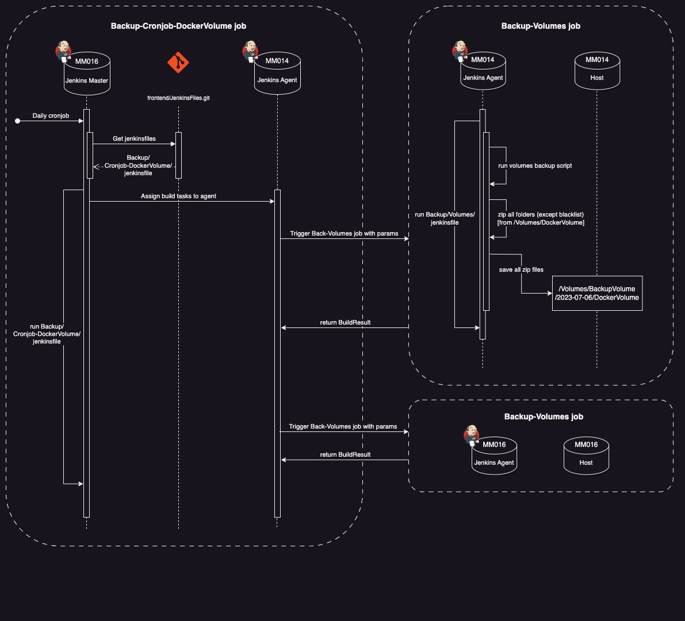
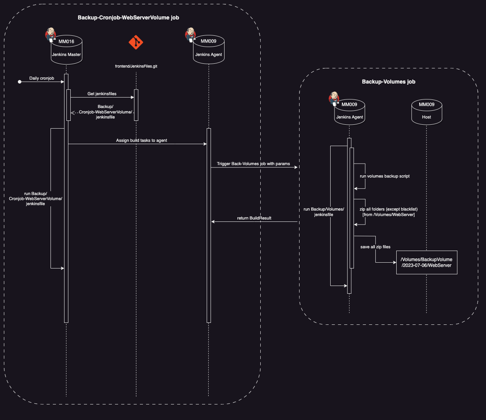
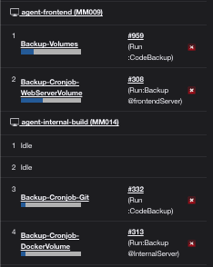
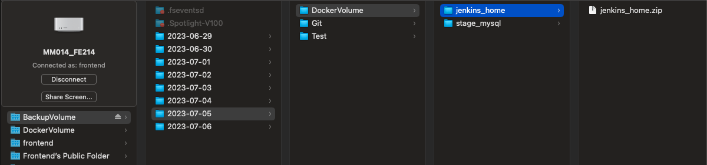
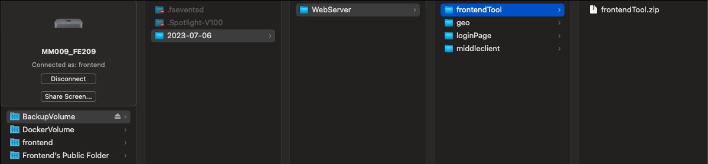

# Volumes backup

This is an integrated application that is developed with node.js and Jenkins that provide backup services of specific agent and specific volume.

The system is mainly divided into two parts.

One is the node.js part that scan the specific volume and zip all files that are not on blacklist.

Another one is the Jenkins part that run the nodejs with date and send the result to **BackupVolume** in specific agent.

It can be called by other cronjobs to backup different volumes in different agent.

## Background:

- a job with parameters called **Backup-Volumes**
    - **backup_agent***: choosing which agent u want to backup
    - **target_volumes_path***: choosing which Volumes u want to backup
    - **folder_blacklist**: choosing which folders u want to ignore
    - * : Required parameters
- called by two cronjob: **Backup-Cronjob-DockerVolume** & **Backup-Cronjob-WebServerVolume**
- take place in **backup_agent (**pass from param**)**
- run nodejs from **Volumes_backup.git**

---

## Aims:

- zip all the folders (except **folder_blacklist**) in the target Volumes

---

## **Prerequisites:**

- Node version >= 16.15.1
- set the server that needs to backup as the Jenkins agent
- get the volume path and blacklist folder name

---

## Usage: Combine with Jenkins cronjob

### 1.  Backup-Cronjob-DockerVolume

- cronjob for servers
- as a task manager to assign different agent to run **Backup-Volume** job
    - **target_volumes_path**: ‘/Volumes/DockerVolume/’
    - **backup_agent:** specific server agent



```jsx
// run docker volume backup in the internal server
catchError(buildResult: 'SUCCESS', stageResult: 'FAILURE') {
    build job: "Backup-Volumes", wait: true, 
    parameters: [
        string(name: 'backup_agent', value: env.AGENT_INTERNAL_BUILD),
        string(name: 'target_volumes_path', value: env.DOCKER_VOLUME_PATH),
        string(name: 'folder_blacklist', value: '')
    ]
}

// run docker volume backup in the prod server
catchError(buildResult: 'SUCCESS', stageResult: 'FAILURE') {
    build job: "Backup-Volumes", wait: true, 
    parameters: [
        string(name: 'backup_agent', value: env.AGENT_PROD),
        string(name: 'target_volumes_path', value: env.DOCKER_VOLUME_PATH),
        string(name: 'folder_blacklist', value: '')
    ]
}
```

---

### 2.  Backup-Cronjob-WebServerVolume

- cronjob for Frontend server (MM009)
- as a task manager to assign agent-frontend to run Backup-Volume job
    - **target_volumes_path**: ‘/Volumes/WebServer/’



```groovy
//run webserver volume backup in frontend server
//BLACKLIST = 'preview'
catchError(buildResult: 'SUCCESS', stageResult: 'FAILURE') {
    build job: "Backup-Volumes", wait: true, 
    parameters: [
        string(name: 'backup_agent', value: env.AGENT_FRONTEND),
        string(name: 'target_volumes_path', value: env.WEB_SERVER_VOLUME_PATH),
        string(name: 'folder_blacklist', value: env.BLACKLIST)
    ]
}
```

---

## Result

- Running cronjob will trigger backup-volume job in different agent to perform backup



### Location of all zip of Docker Volume:

- save in the /Volumes/BackupVolume/DockerVolume
- the date folder will be created within the cronjob



### Location of all zip of WebServer Volume:

- save in the /Volumes/BackupVolume/WebServer
- the date folder will be created within the cronjob



---

### Authors

Cyrus Chang - @ckccyrus